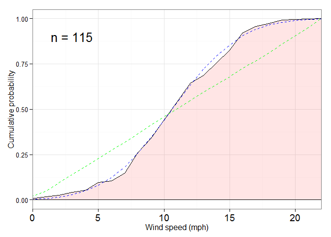
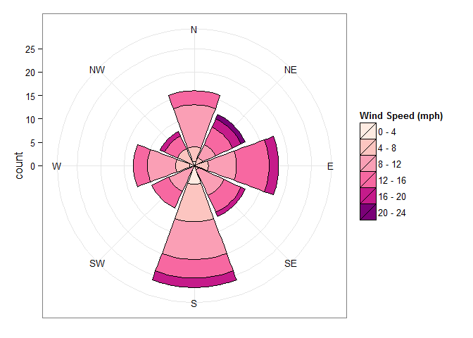

# TGC Tournament Winds
fuzion  
25 August 2015  
### Introduction
I have collected a sample of wind speeds and directions in tournaments for [The Golf Club](http://www.thegolfclubgame.com). 
These are both from rounds that I have played, and from other people (usually by watching their rounds on [twitch](http://www.twitch.tv/directory/game/The%20Golf%20Club)).

I am using [R](https://www.r-project.org/) for the data analysis and presentation.
I include the data in full (at the end of this document), and the code used to generate this analysis in order to make it reproducable.

### Data import


```r
library(dplyr)
library(magrittr)
library(ggplot2)
```

First, I read in the data.

```r
url <- "C:/Users/Matt/Documents/speedgolf/windspeeds.txt" # Point this to the data.
data <- read.table(url, header = TRUE, stringsAsFactors = FALSE)
head(data)
```

```
##      tournament       theme round speed direction  tour
## 1 speed-golf-w2       rural     1     9        SW  TRUE
## 2 speed-golf-w2   highlands     2     3         S  TRUE
## 3  hb-proam-w20 countryside     3    16         N FALSE
## 4  hb-proam-w20 countryside     4    17         E FALSE
## 5       pga-w31 countryside     1    16        NE FALSE
## 6       pga-w31 countryside     2    10         S FALSE
```
The column names show the (abbreviated) name of the tournament, the theme of the course, the round number, the wind speed (mph) on the first tee, the wind direction as given by the cardinal directions, and whether the tournament is a tour or a tournament.

```r
# Convert cardinal direction to angle (degrees)
cardinal_conv <- data.frame(direction = c("N", "NE", "E", "SE", "S", "SW", "W", "NW"), angle = c(0, 45, 90, 135, 180, 225, 270, 315), stringsAsFactors = FALSE)
data %<>% left_join(cardinal_conv, by = "direction")
```
### Analysis
We can calculate some statistics for the wind speeds.
This can also be split by theme.

```r
overview <- data %>% summarise(n = n(), mean_speed = mean(speed), sd_speed = sd(speed), err_mean = sd_speed/sqrt(n))
overview
```

```
##    n mean_speed sd_speed  err_mean
## 1 86         11 4.069976 0.4388768
```

```r
overview_theme <- data %>% group_by(theme) %>% summarise(n = n(), mean_speed = mean(speed), sd_speed = sd(speed), err_mean = sd_speed/sqrt(n))
overview_theme
```

```
## Source: local data frame [8 x 5]
## 
##         theme  n mean_speed sd_speed  err_mean
## 1      boreal 13   11.84615 2.995723 0.8308642
## 2 countryside 23   11.39130 4.282513 0.8929658
## 3       delta  5    9.00000 2.828427 1.2649111
## 4     harvest 10   12.60000 4.647580 1.4696938
## 5   highlands 10   10.70000 3.713339 1.1742610
## 6       links 13   10.61538 5.299976 1.4699488
## 7       rural  4   11.00000 3.559026 1.7795130
## 8    tropical  8    8.75000 3.150964 1.1140339
```
**We can see that the average wind speed is 11.0 &plusmn; 0.4 mph.**

### Pretty plots!
OK, here's the part everyone was waiting for...

```r
wind_qs <- quantile(data$speed, c(0.25,0.5,0.75))
wind_histo <- ggplot(data = data, aes(x = speed)) +
    geom_histogram(aes(y = ..density..), binwidth = 2, fill = "black", colour = "gray", alpha = 0.1) +
    geom_density(alpha = 0.1, fill = "#FF0022", from = 0, to = 20, size = 1) +
    geom_vline(xintercept = wind_qs, colour = "red", linetype = "dotted", size = 0.8) +
    geom_vline(aes(xintercept = mean(speed)), colour = "blue", linetype = "dashed", size = 1) +
    scale_x_continuous(lim = c(0,20), breaks = seq(0,20,4)) +
    labs(x = "Wind speed (mph)", y = "Probability density") +
    geom_text(data = data %>% summarise(n = n()),
              aes(label = paste0("n = ", n),
                  x = 18.5, y = 0.1), size = 7) +
    theme_classic() +
    theme(axis.text.x = element_text(size = 14))
wind_histo
```

 

We can compare this to other typical distributions; here we have a normal cumulative distribution function (cdf; in blue) and one for a uniform distribution (in green).

```r
set.seed(1)
sample_size <- length(data$speed) * 100
uni_winds <- data.frame(speed = sample(1:20, size = sample_size, replace = TRUE))
norm_winds <- data.frame(speed = rnorm(sample_size, overview$mean_speed, overview$sd_speed)) %>% round()

wind_ecdf2 <- ggplot(data = data, aes(x = speed)) +
    stat_ecdf(geom = "area", alpha = 0.1, fill = "red", colour = "black") +
    #stat_ecdf(geom = "step", alpha = 0.1, colour = "black") +
    stat_ecdf(data = uni_winds, geom = "line", colour = "green", linetype = "dashed") +
    stat_ecdf(data = norm_winds, geom = "line", colour = "blue", linetype = "dashed") +
    coord_cartesian(xlim = c(0, 20)) +
    labs(x = "Wind speed (mph)", y = "Cumulative probability") +
    geom_text(data = data %>% summarise(n = n()),
              aes(label = paste0("n = ", n),
                  x = 3, y = 0.9), size = 7) +
    theme_bw() +
    theme(axis.text.x = element_text(size = 14))
wind_ecdf2
```

 

**We see that we only have a 34.9% chance to have single digit winds for a given tournament round.**

(A cumulative distribution gives you the probability of getting a value &le; x on a sample, so we read up from 9 mph and go left to find the chances of getting a wind speed of 9 or less.)

We can also look at the direction of the wind, and plot a form of windrose.


```r
windplot2 <- ggplot(data = data, aes(x = angle, y = speed)) +
    annotate("rect", xmin = 0, xmax = 360, ymin = 0, ymax = 5, alpha = 0.2, fill = "green") +
    annotate("rect", xmin = 0, xmax = 360, ymin = 5, ymax = 10, alpha = 0.2, fill = "blue") +
    annotate("rect", xmin = 0, xmax = 360, ymin = 10, ymax = 15, alpha = 0.2, fill = "yellow") +
    annotate("rect", xmin = 0, xmax = 360, ymin = 15, ymax = 20, alpha = 0.2, fill = "red") +
    geom_point(size = 6, shape = 21, colour = "black", aes(fill = theme)) +
    scale_x_continuous(breaks = seq(0,315,45), lim = c(0, 360), labels = cardinal_conv$direction) +
    scale_y_continuous(breaks = seq(0,20,5), lim = c(0, 20)) +
    labs(y = "Wind speed (mph)", fill = "Theme") +
    scale_fill_brewer(palette = "Set1") +
    coord_polar(theta = "x", start = 0, direction = 1) +
    theme_bw() +
    theme(axis.title.x = element_blank())
windplot2
```

 

```r
source("C:/Users/Matt/Documents/speedgolf/windrose.R")
windrose2 <- plot.windrose(data = data, spd = "speed", dir = "angle",
                   spdseq = seq(0,20,4),
                   dirres = 45,
                   palette = "RdPu") +
    scale_x_discrete(labels = cardinal_conv$direction) +
    theme_bw() +
    theme(axis.title.x = element_blank())
```

```r
windrose2
```

 

### Summary

Tournament winds in The Golf Club tend to be slightly higher than [real life wind speeds](http://average-wind-speed.findthebest.com/) e.g. North Carolina: 7.5 mph; Chicago: 10.3 mph.
Also, they affect the ball significantly more than they should, even on 4 yard chip shots in game.
This makes the tournament side of the game intimidating for newer players.

Without more data, I cannot tell if the theme makes a significant difference to the wind speeds. 

I am in favour of more local gusts in-game, to better simulate the weather conditions, and also to limit the amount of exact calculation to offset the winds' effect.
Without winds, the game becomes very easy to calculate, e.g. see the 52 (-20) I shot yesterday in 1 mph winds in the HB ProAm tournament.

### Appendix

```r
data
```

```
##          tournament       theme round speed direction  tour angle
## 1     speed-golf-w2       rural     1     9        SW  TRUE   225
## 2     speed-golf-w2   highlands     2     3         S  TRUE   180
## 3      hb-proam-w20 countryside     3    16         N FALSE     0
## 4      hb-proam-w20 countryside     4    17         E FALSE    90
## 5           pga-w31 countryside     1    16        NE FALSE    45
## 6           pga-w31 countryside     2    10         S FALSE   180
## 7           pga-w31 countryside     3    10        SW FALSE   225
## 8           pga-w31 countryside     4     9         E FALSE    90
## 9          euro-w31   highlands     1    12         S  TRUE   180
## 10         euro-w31   highlands     2    14        NE  TRUE    45
## 11         euro-w31   highlands     3     9         W  TRUE   270
## 12         euro-w31   highlands     4    15         E  TRUE    90
## 13    speed-golf-w4       rural     1    11        SE  TRUE   135
## 14    speed-golf-w4 countryside     2    12        NE  TRUE    45
## 15      bridgestone countryside     1    13         S  TRUE   180
## 16      bridgestone countryside     2    15         W  TRUE   270
## 17      bridgestone countryside     3     4         S  TRUE   180
## 18      bridgestone countryside     4    10         N  TRUE     0
## 19          pga-w32      boreal     1    12         W FALSE   270
## 20          pga-w32      boreal     2    11         W FALSE   270
## 21          pga-w32      boreal     3    14        SW FALSE   225
## 22          pga-w32      boreal     4    11         N FALSE     0
## 23         euro-w32     harvest     1    18         S FALSE   180
## 24         euro-w32     harvest     2    10         S FALSE   180
## 25           cc-w32    tropical     1     8         W FALSE   270
## 26           cc-w32    tropical     2     5         S FALSE   180
## 27           cc-w32    tropical     3     9         N FALSE     0
## 28           cc-w32    tropical     4    13        SW FALSE   225
## 29     hb-elite-w22   highlands     1     8         S FALSE   180
## 30     hb-elite-w22   highlands     2    15         E FALSE    90
## 31     hb-elite-w22   highlands     3    10         W FALSE   270
## 32     hb-elite-w22   highlands     4     9         N FALSE     0
## 33    tgct-practice       links     1    17        NE  TRUE    45
## 34    tgct-practice       links     2    14         W  TRUE   270
## 35    tgct-practice       links     3    14         N  TRUE     0
## 36    tgct-practice       links     4     1         S  TRUE   180
## 37       pga-warmup       links     3     8        NW  TRUE   315
## 38 pga-championship       links     1     7         S  TRUE   180
## 39 pga-championship       links     2    14         N  TRUE     0
## 40 pga-championship       links     3    12        NE  TRUE    45
## 41 pga-championship       links     4    11        NE  TRUE    45
## 42    speed-golf-w5       rural     1    16        SE  TRUE   135
## 43    speed-golf-w5      boreal     2    13        SE  TRUE   135
## 44          web-w33      boreal     1    10        SE FALSE   135
## 45          web-w33      boreal     2    15        SE FALSE   135
## 46          web-w33      boreal     3     9         S FALSE   180
## 47          web-w33      boreal     4     9        SE FALSE   135
## 48         euro-w33 countryside     1     2         S FALSE   180
## 49         euro-w33 countryside     2    16        SE FALSE   135
## 50         euro-w33 countryside     3    10         E FALSE    90
## 51         euro-w33 countryside     4    16        NW FALSE   315
## 52          pga-w33 countryside     1     8         N FALSE     0
## 53          pga-w33 countryside     2     8        SE FALSE   135
## 54          pga-w33 countryside     3    11         S FALSE   180
## 55          pga-w33 countryside     4    10         S FALSE   180
## 56           cc-w33     harvest     1    14         W  TRUE   270
## 57           cc-w33     harvest     2    12         E  TRUE    90
## 58           cc-w33     harvest     3    10         S  TRUE   180
## 59           cc-w33     harvest     4     8         W  TRUE   270
## 60        scarpacci     harvest     6    18        NE  TRUE    45
## 61        scarpacci     harvest     7    12         E  TRUE    90
## 62     hb-proam-w23      boreal     1    12        SW FALSE   225
## 63     hb-proam-w23      boreal     2    17        SE FALSE   135
## 64     hb-proam-w23      boreal     3    15        NW FALSE   315
## 65     hb-proam-w23      boreal     4     6        NW FALSE   315
## 66     hb-elite-w23       delta     1    11        SE FALSE   135
## 67     hb-elite-w23       delta     2    11         N FALSE     0
## 68     hb-elite-w23       delta     3    11         N FALSE     0
## 69     hb-elite-w23       delta     4     5        NE FALSE    45
## 70    speed-golf-w6       rural     1     8         E  TRUE    90
## 71    speed-golf-w6   highlands     2    12         E  TRUE    90
## 72         euro-w34    tropical     1    10        SW  TRUE   225
## 73         euro-w34    tropical     1     5         N  TRUE     0
## 74         euro-w34    tropical     1    13         E  TRUE    90
## 75         euro-w34    tropical     1     7         S  TRUE   180
## 76          pga-w34 countryside     1    14        SW  TRUE   225
## 77          pga-w34 countryside     2     9        SE  TRUE   135
## 78          pga-w34 countryside     3     7         E  TRUE    90
## 79          hb-ko-1     harvest     1     5         N FALSE     0
## 80          hb-ko-1     harvest     2    19         S FALSE   180
## 81           cc-w34 countryside     1    19         E  TRUE    90
## 82          web-w34       delta     1     7         E FALSE    90
## 83     hb-proam-w24       links     1    15        SW FALSE   225
## 84     hb-proam-w24       links     2     1         W FALSE   270
## 85     hb-proam-w24       links     3     8         S FALSE   180
## 86     hb-proam-w24       links     4    16         E FALSE    90
```
